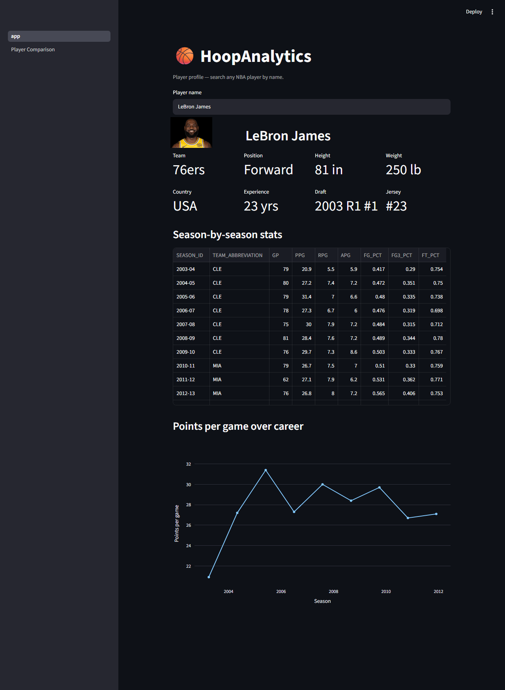
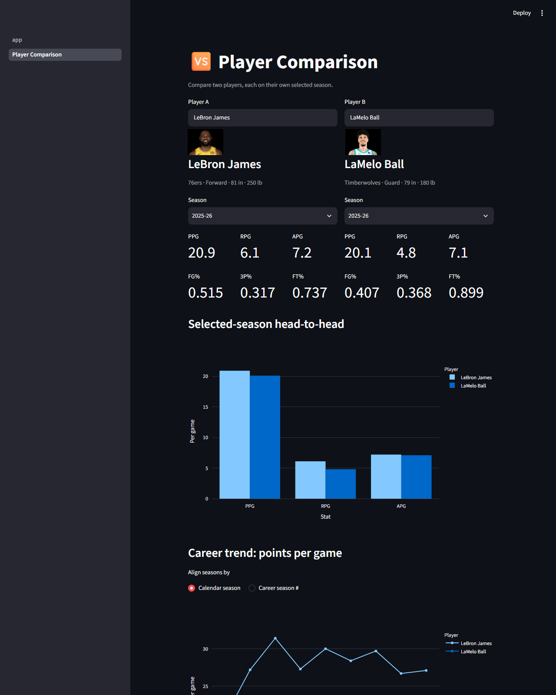

# HoopAnalytics

A full-stack NBA data analytics app: a pipeline that fetches player stats
from the NBA Stats API, cleans and caches them in SQLite, and a Streamlit
app for exploring and comparing players. Built as a portfolio project to
practice a real fetch → clean → store → serve pipeline end to end, not just
a notebook analysis.

## Features

- **Player profile page** — search any NBA player by name to see their
  bio, season-by-season stats (with per-game averages computed from raw
  season totals), and a career points-per-game trend chart.
- **Player comparison page** — pick two players, each on an independently
  selected season (e.g. LeBron's 2025-26 vs. LaMelo's rookie year), and see
  a head-to-head bar chart plus a full-career trend chart overlaying both
  players — switchable between real calendar seasons and "season # in
  career," so trajectories stay comparable even across different eras.
- Player headshots on both pages.
- First search for a player fetches live and caches the result; every
  later search for that player is a fast local read.

| Player profile | Player comparison |
|---|---|
|  |  |

## Architecture

```
nba_api  →  src/fetch.py  →  src/clean.py  →  src/database.py  →  app.py / pages/
 (live)      (cache raw       (raw JSON to     (SQLite: players +   (Streamlit,
              JSON to           typed            career_stats         DB-first,
              data/raw/)        DataFrames)       tables)              pipeline on
                                                                        cache miss)
```

- `src/fetch.py` — talks to the live `nba_api` endpoints, with a bounded
  timeout + retries (fails loudly instead of hanging) and a raw-JSON cache
  in `data/raw/` so a flaky call is never re-hit once it's succeeded.
- `src/clean.py` — reshapes raw API JSON into typed `pandas` DataFrames,
  keeping only the fields the app actually uses.
- `src/database.py` — a real SQLite schema (`players`, `career_stats`, with
  a proper primary/foreign key relationship), not just a `DataFrame.to_sql`
  dump.
- `src/pipeline.py` — the Streamlit-facing glue: checks the database first,
  falls back to the full fetch → clean → insert pipeline on a cache miss.
- `app.py` / `pages/` — the Streamlit UI, using the database as a real
  cache rather than hitting the API on every page load.

## Setup

```bash
python -m venv .venv
source .venv/bin/activate  # on Windows: .venv\Scripts\activate
pip install -r requirements.txt
```

## Running the app

```bash
streamlit run app.py
```

Search any NBA player by name on the **Player Profile** page, or switch to
**Player Comparison** in the sidebar to compare two players.

## Known limitations

- The live `stats.nba.com` endpoints used by `nba_api` can hang or time
  out under some network conditions (in this project's case, a VPN was
  the actual cause — see `PROGRESS.md` for the full investigation).
  `fetch.py` handles this with a short timeout and bounded retries, but a
  sustained outage on NBA's end would still make new (uncached) player
  lookups fail.
- Player headshots are loaded from an unofficial NBA CDN URL pattern (not
  part of `nba_api`'s documented endpoints). If NBA changes that URL
  scheme, only the photos would break, not the stats.
- No automated tests yet (`tests/` is currently empty) — everything has
  been verified by running the pipeline and the app directly.

## Project structure

```
app.py           # Streamlit entry point (player profile page)
pages/           # additional Streamlit pages (player comparison)
src/
  fetch.py       # nba_api calls, with caching/timeout/retry
  clean.py       # raw JSON -> typed DataFrames
  database.py    # SQLite schema + insertion
  pipeline.py    # Streamlit-facing DB-first lookup, shared by all pages
data/
  raw/           # cached raw API responses (gitignored)
  processed/     # SQLite database (gitignored)
notebooks/       # exploratory notebooks
docs/            # methodology notes and README images
tests/           # automated tests (not yet populated)
```

## Disclaimer

This is an unofficial, personal portfolio project. It is not affiliated
with, endorsed by, or sponsored by the NBA. Player data comes from the
public `nba_api` library; player photos are loaded from NBA's own CDN.

## Status

See [PROGRESS.md](PROGRESS.md) for the current task and [ROADMAP.md](ROADMAP.md)
for the full project plan.
