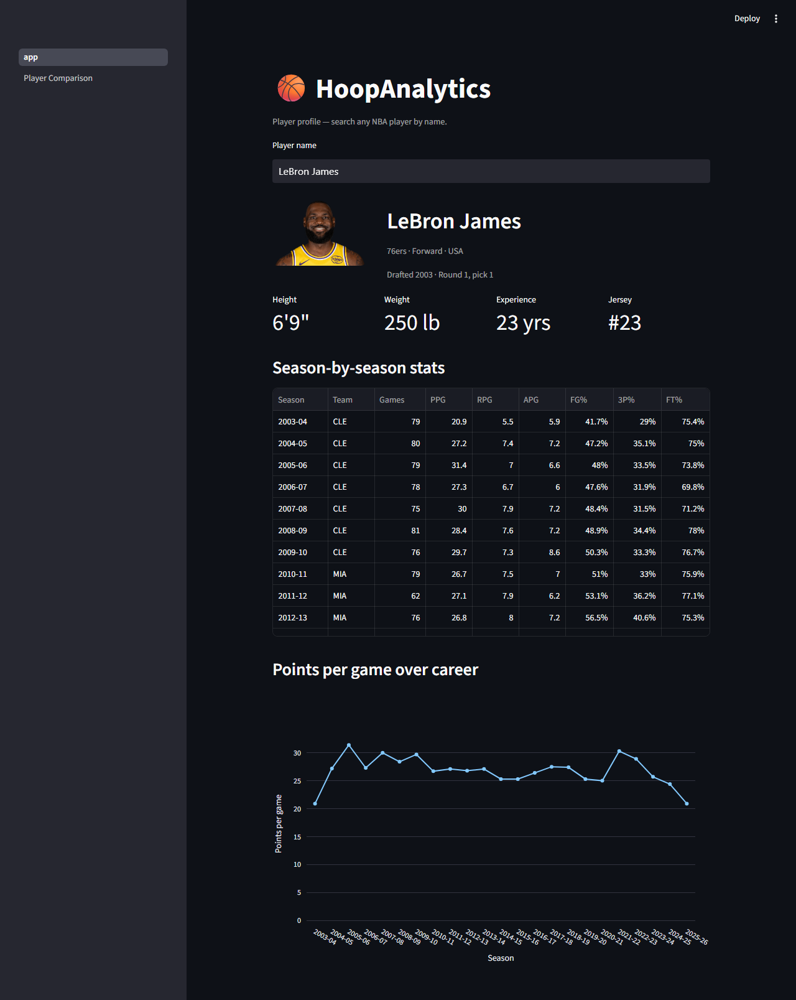
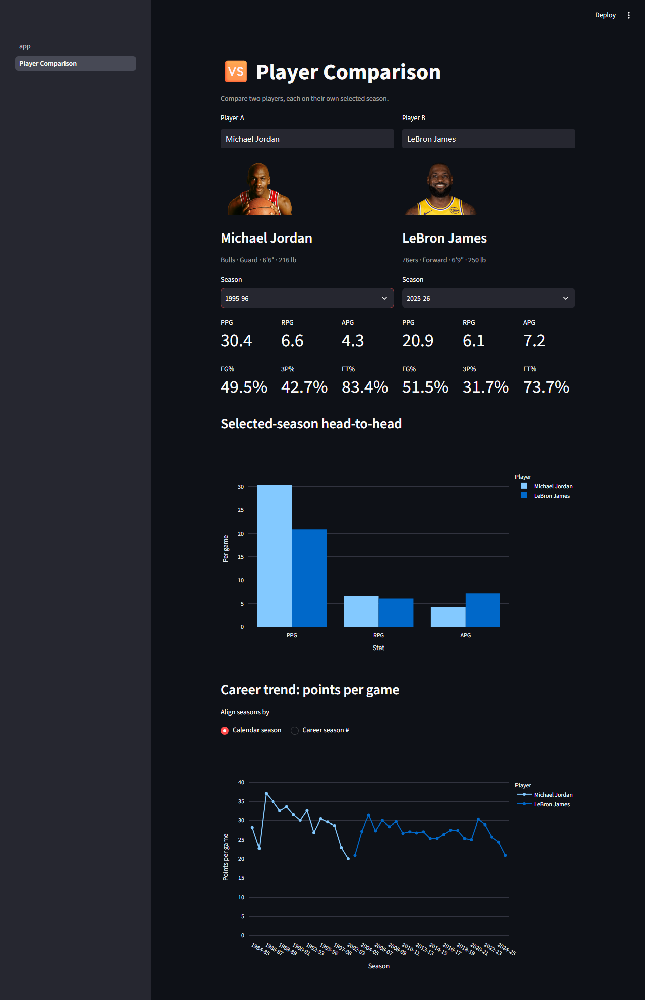

# HoopAnalytics

A full-stack NBA data analytics app: a pipeline that fetches player stats
from the NBA Stats API, cleans and caches them in SQLite, and a Streamlit
app for exploring and comparing players. Built as a portfolio project to
practice a real fetch → clean → store → serve pipeline end to end, not just
a notebook analysis.

## Features

- **Player profile page** — search any NBA player by name to see their
  bio, season-by-season stats (with per-game averages computed from raw
  season totals), and a career points-per-game trend chart.
- **Player comparison page** — pick two players, each on an independently
  selected season (e.g. LeBron's 2025-26 vs. LaMelo's rookie year), and see
  a head-to-head bar chart plus a full-career trend chart overlaying both
  players — switchable between real calendar seasons and "season # in
  career," so trajectories stay comparable even across different eras.
- Typo-tolerant search with live suggestions as you type (e.g. "micheal
  jordn" still finds Michael Jordan), across every NBA player ever, not
  just the pre-seeded ones.
- Player headshots on both pages.
- First search for a player fetches live and caches the result; every
  later search for that player is a fast local read.

| Player profile | Player comparison |
|---|---|
|  |  |

## Try it

- **Live demo:** [hoopanalytics.streamlit.app](https://hoopanalytics.streamlit.app/) — no install needed. Any NBA player, current or retired; current players are pre-seeded and load instantly.
- **Run it yourself:** see [docs/GETTING_STARTED.md](docs/GETTING_STARTED.md) for a step-by-step guide with screenshots, no prior Python/Git experience assumed.

## Architecture

```
nba_api  →  src/fetch.py  →  src/clean.py  →  src/database.py  →  app.py / pages/
 (live)      (cache raw       (raw JSON to     (SQLite: players +   (Streamlit,
              JSON to           typed            career_stats         DB-first,
              data/raw/)        DataFrames)       tables)              pipeline on
                                                                        cache miss)
```

- `src/fetch.py` — talks to the live `nba_api` endpoints, with a bounded
  timeout + retries (fails loudly instead of hanging) and a raw-JSON cache
  in `data/raw/` so a flaky call is never re-hit once it's succeeded.
- `src/clean.py` — reshapes raw API JSON into typed `pandas` DataFrames,
  keeping only the fields the app actually uses.
- `src/database.py` — a real SQLite schema (`players`, `career_stats`, with
  a proper primary/foreign key relationship), not just a `DataFrame.to_sql`
  dump.
- `src/pipeline.py` — the Streamlit-facing glue: checks the database first,
  falls back to the full fetch → clean → insert pipeline on a cache miss.
- `app.py` / `pages/` — the Streamlit UI, using the database as a real
  cache rather than hitting the API on every page load.

## Setup

```bash
python -m venv .venv
source .venv/bin/activate  # on Windows: .venv\Scripts\activate
pip install -r requirements.txt
```

## Running the app

```bash
streamlit run app.py
```

Search any NBA player by name on the **Player Profile** page, or switch to
**Player Comparison** in the sidebar to compare two players.

## Known limitations

- **`stats.nba.com` blocks cloud-hosted requests** — handled with a relay.
  NBA's live stats API sits behind bot protection that blocks AWS/GCP/Azure
  datacenter IP ranges, which nearly every cloud host (Streamlit Community
  Cloud included) runs on, so the deployed app can't call it directly.
  The deployed app instead sends its requests through a small Cloudflare
  Worker ([`relay/worker.js`](relay/worker.js)) that forwards them to
  `stats.nba.com` from Cloudflare's network, guarded by a shared secret.
  The relay is only used when `RELAY_URL` and `RELAY_KEY` are set in the
  app's Streamlit secrets; running locally, requests go direct.
  The deployed database is also pre-seeded with every player on a current
  NBA roster (`src/seed.py`), so those load instantly without any API call.
  If a fetch still fails, the app shows a short notice and keeps the
  current player on screen instead of crashing; after one failure, live
  fetches pause for 5 minutes so later picks fail instantly.
- **The live demo can be slow to open.** Streamlit Community Cloud puts
  apps to sleep after 12 hours without visitors, and the next visitor has
  to wake it up (up to a minute or so). A scheduled GitHub Actions
  workflow (`.github/workflows/keep-awake.yml`) visits the app every 6
  hours with a headless browser to prevent this. Caveat: GitHub disables
  scheduled workflows after 60 days without repository activity. Once
  awake, a first visit takes ~10s (the browser downloads Streamlit's and
  Plotly's JavaScript once) and a reload ~3s.
- Player headshots are loaded from an unofficial NBA CDN URL pattern (not
  part of `nba_api`'s documented endpoints). If NBA changes that URL
  scheme, only the photos would break, not the stats.
- No automated tests yet (`tests/` is currently empty) — everything has
  been verified by running the pipeline and the app directly.

## Project structure

```
app.py           # Streamlit entry point (player profile page)
pages/           # additional Streamlit pages (player comparison)
src/
  fetch.py       # nba_api calls, with caching/timeout/retry
  clean.py       # raw JSON -> typed DataFrames
  database.py    # SQLite schema + insertion
  pipeline.py    # Streamlit-facing DB-first lookup, shared by all pages
  ui.py          # shared UI pieces: player search box, chart zoom limits
  seed.py        # builds the committed seed database (active players)
data/
  raw/           # cached raw API responses (gitignored)
  processed/     # SQLite database (gitignored, bootstrapped from seed)
  seed/          # committed seed database (active players, see src/seed.py)
notebooks/       # exploratory notebooks
scripts/         # ops scripts (keep_awake.py: keeps the live demo awake)
relay/           # Cloudflare Worker relaying requests to stats.nba.com
.github/         # GitHub Actions workflows (scheduled keep-awake visit)
docs/            # methodology notes, README images, getting-started guide
tests/           # automated tests (not yet populated)
```

## Disclaimer

This is an unofficial, personal portfolio project. It is not affiliated
with, endorsed by, or sponsored by the NBA. Player data comes from the
public `nba_api` library; player photos are loaded from NBA's own CDN.

## Status

See [PROGRESS.md](PROGRESS.md) for the current task and [ROADMAP.md](ROADMAP.md)
for the full project plan.
