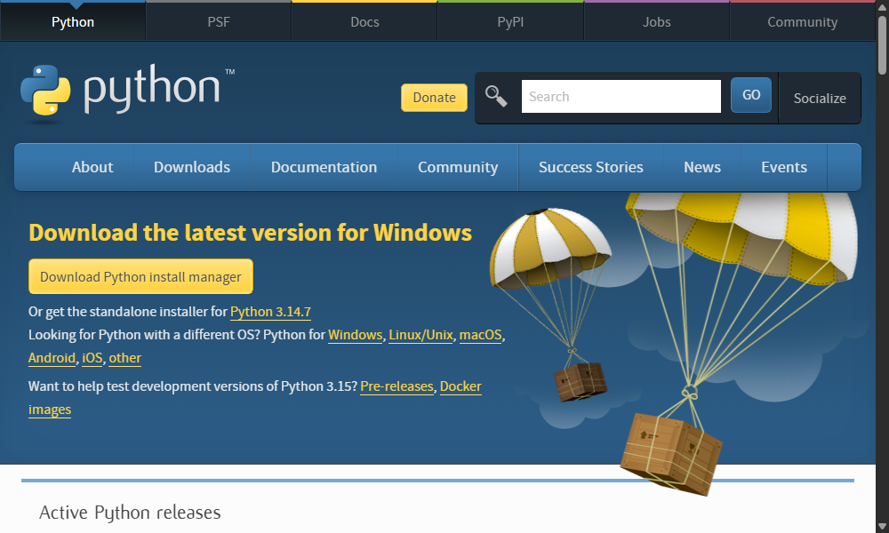
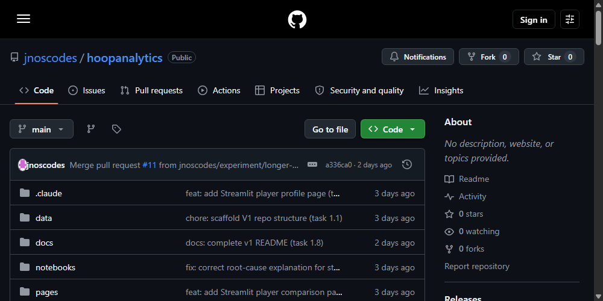
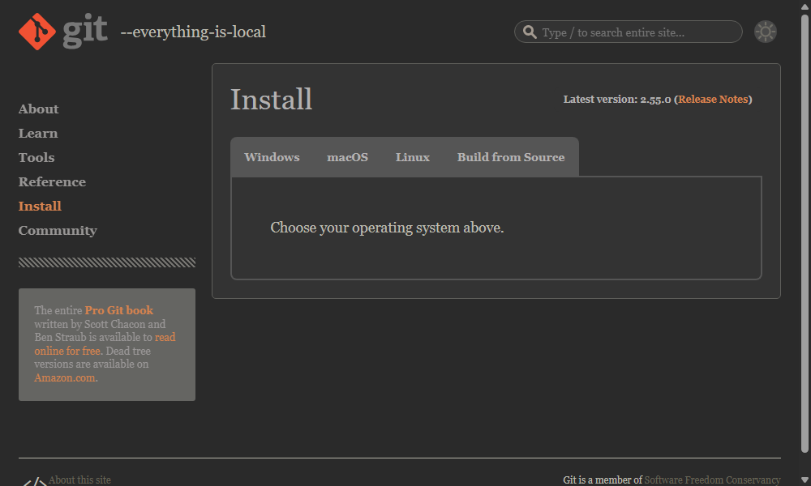

# Getting Started with HoopAnalytics

This guide walks through running HoopAnalytics on your own computer, step
by step, assuming no prior experience with Python, Git, or the command
line. It should take about 10 minutes.

If you'd rather not install anything, you can also try the
[live demo](https://hoopanalytics.streamlit.app/) — see the note at the
bottom of this guide about its current limitations before you do.

## What you'll need

- **Python** (version 3.10 or newer) — the programming language the app is
  written in.
- **Git** (optional) — used to download the project; you can also just
  download a ZIP file instead, no Git required.
- **A terminal** — a text-based window for typing commands. Every
  operating system has one built in (see Step 4).

## Step 1 — Install Python

Skip this step if you already have Python 3.10+ installed.

1. Go to [python.org/downloads](https://www.python.org/downloads/).
2. Click the yellow download button — it automatically detects your
   operating system.

   

3. Run the installer.
   - **Windows:** on the very first screen, check the box that says
     **"Add python.exe to PATH"** before clicking Install. This is the
     single most common thing people forget, and without it your terminal
     won't be able to find Python afterward.
   - **Mac:** run the downloaded `.pkg` installer and follow the prompts;
     no extra checkboxes needed.

## Step 2 — Download the project

You have two options — pick whichever feels easier.

**Option A: Download ZIP (no Git needed)**

1. Go to the [HoopAnalytics GitHub page](https://github.com/jnoscodes/hoopanalytics).
2. Click the green **Code** button, then **Download ZIP**.

   

3. Unzip the downloaded file somewhere you'll remember, e.g. your Desktop.

**Option B: Clone with Git**

If you have Git installed (or want to
[install it](https://git-scm.com/downloads)):

```bash
git clone https://github.com/jnoscodes/hoopanalytics.git
```



## Step 3 — Open a terminal in the project folder

- **Windows:** open the unzipped/cloned `hoopanalytics` folder in File
  Explorer, then right-click inside it and choose **"Open in Terminal"**
  (or hold Shift, right-click, and choose "Open PowerShell window here"
  on older Windows versions).
- **Mac:** open the **Terminal** app (search for it with Spotlight,
  Cmd+Space), then type `cd ` (with a trailing space), drag the
  `hoopanalytics` folder into the terminal window, and press Enter.

You should see a prompt with `hoopanalytics` somewhere in the path.

## Step 4 — Set up the environment and install dependencies

Copy-paste these commands into the terminal you just opened, one at a
time, pressing Enter after each.

**Windows:**

```bash
python -m venv .venv
.venv\Scripts\activate
pip install -r requirements.txt
```

**Mac / Linux:**

```bash
python3 -m venv .venv
source .venv/bin/activate
pip install -r requirements.txt
```

This creates an isolated environment for the project's dependencies and
installs them (`nba_api`, `pandas`, `streamlit`, `plotly`). It downloads
a fair amount and can take a minute or two — that's normal.

## Step 5 — Run the app

```bash
streamlit run app.py
```

Your browser should open automatically to `http://localhost:8501`. If it
doesn't, open that address manually. You should see this:


Type any NBA player's name to search, or use the **Player Comparison**
page in the sidebar to compare two players:


To stop the app, go back to the terminal and press `Ctrl+C`.

## Troubleshooting

- **`python` / `python3` not recognized:** Python wasn't added to your
  system PATH during installation. Re-run the Python installer and make
  sure the PATH checkbox is checked (Windows), or try `python3` instead
  of `python` (Mac/Linux).
- **`pip install` fails or hangs:** check your internet connection; some
  corporate/school networks block package downloads.
- **The page loads but a player search never finishes:** the live NBA
  Stats API is known to be slow or occasionally blocked from certain
  networks — see the "Known limitations" section in the main
  [README](../README.md). Try a different, well-known player (e.g.
  "LeBron James"), or try again after a few minutes.
- **Port 8501 already in use:** another Streamlit app is already running.
  Close it, or run `streamlit run app.py --server.port 8502` and open
  that port instead.

## About the live demo link

The [live demo](https://hoopanalytics.streamlit.app/) is convenient
because it needs no setup, but it currently has a real limitation: the
NBA's stats API blocks requests from major cloud hosting providers
(documented in `PROGRESS.md`), so a search for a player who isn't already
cached in the live app's database can fail. The app is pre-seeded with
every player on a current NBA roster, so most searches work reliably —
but if you want to explore comprehensively (older/retired players, or
just to be certain), running it locally via this guide is the more
reliable option for now.
